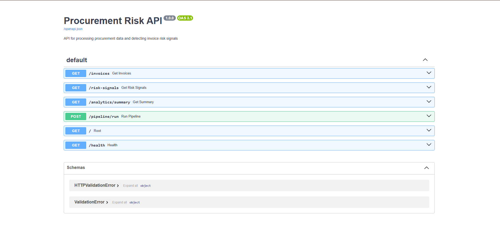

# Procurement Risk API

A backend/data engineering project that ingests invoice data from CSV, stores it in a SQLite database, detects procurement risk signals, and exposes the results through a FastAPI API.

## Tech Stack
- Python
- FastAPI
- SQLAlchemy
- SQLite
- CSV ingestion

## Features
- CSV ingestion pipeline
- Database-backed API
- Risk detection:
  - Duplicate invoices
  - Amount below threshold
  - Weekend invoices
- Filtering by amount and severity
- Analytics summary endpoint
- Pipeline trigger endpoint

## Endpoints
- `GET /invoices`
- `GET /risk-signals`
- `GET /analytics/summary`
- `POST /pipeline/run`

## Run locally

```bash
python -m venv venv
source venv/bin/activate
pip install -r requirements.txt
python -m app.init_db
uvicorn app.main:app --reload
```


## API Docs

